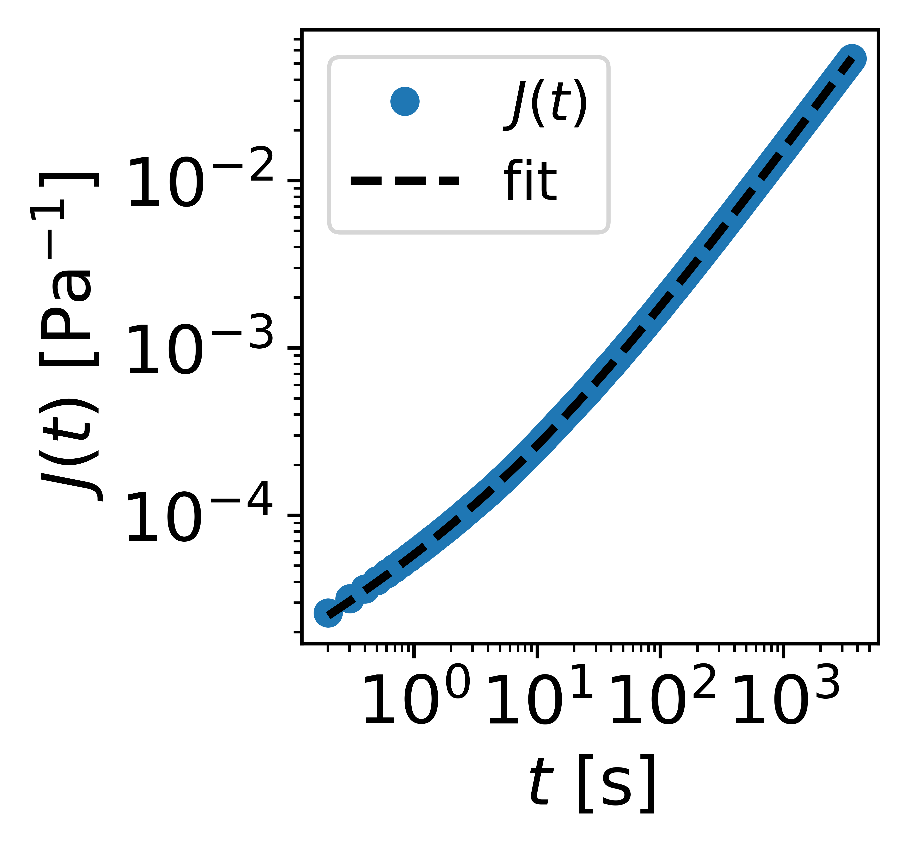

# Introduction

Welcome to pyRheo's documentation.
pyRheo is a Python package for fitting viscoelastic models to rheological data from creep, stress relaxation, oscillation, and rotation tests.

Check out the Quick Start section for more information on getting started, including an Installation guide.

> ⚠️ **Note:**  
> pyRheo is under active development. Come back for updates.

## Table of Contents

- [Introduction](#introduction)
  - [pyRheo](#pyRheo)
  - [Citing](#citing)
  - [News](#news)
  - [Installation](#installation)
  - [Contributing](#contributing)
- [Quick Start](#quick-start)
  - [Installation](#installation-1)
  - [Preparing data](#preparing-data)
  - [Fitting data](#fitting-data)
  - [Plotting results](#plotting-resutls)
  - [Analyzing results](#analyzing-results)
- [Machine Learning classifier](#machine-learning-classifier)
  - [Data standardization](#data-standardization)
  - [Multi-Layer Perceptron](#multi-layer-perceptron)
- [API](#api)
  - [Creep](#creep)
  - [Stress relaxation](#relaxation)
  - [Oscillation](#oscillation)
  - [Rotation](#rotation)

## pyRheo
pyRheo is a Python package for automatically finding and fitting a viscoelastic model to describe data from creep, stress relaxation, small amplitude oscillatory shear, and steady shear flow.

## Citing
This package is based on the methodology described in **pyRheo: An open-source Python package for complex rheology**. If you use the software and feel that it was useful for your research, please cite this manuscript.

```
@article{miranda-valdez_niinisto_makinen_lejon_koivisto_alava_2024,
    doi = {https://doi.org/10.1039/D5DD00021A},
    url = {https://pubs.rsc.org/en/Content/ArticleLanding/2025/DD/D5DD00021A},
    author = {Miranda-Valdez, Isaac Y. and Niinistö, Aaro and Mäkinen, Tero and Lejon, Juha and Koivisto, Juha and Alava, Mikko J.},
    title = {pyRheo: An open-source Python package for complex rheology},
    publisher = {Digital Discovery},
    year = {2025},
}
```

## News
No news at the moment.

## Installation
At the moment, the way to install **pyRheo** is via pip as instructed in the main page of the GitHub repository. Later on, it will be easier with Python Package Index using pip.

Install the `pyRheo` package directly from GitHub using pip:

```sh
pip install git+https://github.com/mirandi1/pyRheo.git
```

it requires having Git installed.

## Contributing
Issues, suggestions, feedback, or any comment can be sent directly to isaac.mirandavaldez[at].aalto.fi or by rising an issues on pyRheo's GitHub.

# Quick start

## Installation
The installation is via pip as instructed in the main page. 

Install the `pyRheo` package directly from GitHub using pip:

```sh
pip install git+https://github.com/mirandi1/pyRheo.git
```

## Preparing data
For using pyRheo, we recommend importing the following libraries:

```python
import pandas as pd  # For data manipulation and analysis
import numpy as np  # For numerical operations
import matplotlib.pyplot as plt  # For plotting
from pyRheo.creep_model import CreepModel   # For rheological modeling
from pyRheo.relaxation_model import RelaxationModel   # For rheological modeling
from pyRheo.oscillation_model import SAOSModel   # For rheological modeling
from pyRheo.rotation_model import SteadyShearModel   # For rheological modeling
```

In this case, let's import experimental data from a creep experiment:

```python
# The file contains time (time) and compliance (J_creep) data.
data = pd.read_csv('creep_ps190_data.csv', delimiter='\t', decimal=".")

# Extract time and compliance as numpy arrays
time = data['Time'].values
J_creep = data['Creep Compliance'].values
```

## Fitting data
For fitting the data, let's first create a model object

```python
model_creep = CreepModel(model="FractionalMaxwellLiquid",  # Choose a model, if "auto", it will use a Machine Learning classifier to decide
                        initial_guesses="random",         # The fitting starts with random initial guesses for the parameters
                        bounds = "auto",                  # The auto method considers the lowest and highest values in the dataset and adds a margin. If manual, use e.g., bounds = [(1e0, 1e6), (1e0, 1e6), (0.01, 0.99)]
                        num_initial_guesses=10,           # The fitting restarts 10 times with different initial guesses for the parameters
                        minimization_algorithm="Powell",  # Optimization algorithm for global optimization
                        mittag_leffler_type="Pade63"      # Method to compute the Mittag-Leffler function
                        )
```

Fit the defined model object

```python
model_creep.fit(time, J_creep)
```

## Analyzing results
If the fitting is succesfull, print the parameter results with:

```python
# Print the fitted parameters and error metrics
model_creep.print_parameters()  # Display model parameters
model_creep.print_error()       # Display error of the fit
```

It is also possible to store the parameters as a dictionary for further operations:

```python
model_creep.get_parameters()
```

For example, the parameters are stored as:

```sh
{'G': 25856.763541580505,
 'eta_s': 68281.08243229917,
 'beta': 0.4223496565227164,
 'RSS': 0.04791247579367503}
```

## Plotting results
There are several ways to plot the results obtained with pyRheo. The quickest method is using the automatic plot function integrated in the package:

```python
# Plot the experimental data and the model prediction
model_creep.plot(time, J_creep, savefig=False)  # Quick overview plot
```



For advanced plotting, it is possible to call the model object to predict over a given interval. First, define the new interval:

```python
# Generate predictions using the fitted model for a smooth curve
time_predict = np.logspace(np.min(np.log10(time)), np.max(np.log10(time)), 100) # Generate log distirbuted interval
J_creep_predict = model_creep.predict(time_predict) # In the case of oscillation, the model object returns two arrays, eg G_prime, G_double_prime = model_oscillation.predict(omega_predict)
```

Plot the results

```python
# Create a new figure with adjusted size for better visualization
plt.figure(figsize=(3.2, 3))

# Plot experimental data
plt.plot(time, J_creep, 'o', markersize=6, markevery=1, alpha=1)

# Plot the model predictions
plt.plot(time_predict, J_creep_predict, '-', color="k", lw=2, label='$J(t)$ fit')

# Set logarithmic scales for both axes
plt.xscale("log")
plt.yscale("log")

# Customize axis labels, ticks, and font sizes
plt.xticks(fontsize=16)
plt.yticks(fontsize=16)
plt.xlabel(r'$t$ [s]', fontsize=16)
plt.ylabel(r'$J(t)$ [Pa$^{-1}$]', fontsize=16)

# Add a legend with customized font size
plt.legend(fontsize=13.5, handletextpad=0.5)

# Final plot adjustments for readability
plt.grid(False)
plt.tight_layout()

# Display the plot
plt.show()
```

Alternatively, it is possible to use the dictionary obtained with `model_creep.get_parameters()` to compute the results and the theoretical responses of the other kind of experiments, relaxation and oscillation:

```python
# Import tools
from pyRheo.creep_evaluator import CreepEvaluator
from pyRheo.relaxation_evaluator import RelaxationEvaluator
from pyRheo.oscillation_evaluator import OscillationEvaluator

# Define objects
evaluator_creep = CreepEvaluator(model="FractionalMaxwellLiquid")
evaluator_relax = RelaxationEvaluator(model="FractionalMaxwellLiquid")
evaluator_oscillation = OscillationEvaluator(model="FractionalMaxwellLiquid")

# Store the parameter from model_creep fitted
params_dictionary = model.get_parameters()

# Extract the desired keys and convert their values to a list
selected_keys = ['G', 'eta_s', 'beta']
params = [params_dictionary[key] for key in selected_keys]

# Compute theoretical responses
J_creep_predict = evaluator_creep.compute_model(params, time_predict, mittag_leffler_type="Pade63")
G_relax_predict = evaluator_relax.compute_model(params, time_predict, mittag_leffler_type="Pade63")
G_prime_predict, G_double_prime_predict = evaluator_oscillation.compute_model(params, time_predict) # angular frequency instead of time
```

# Tutorials
The folder `/demos` contains several tutorial that show how to use pyRheo for modeling creep, stress relaxation, oscillation, and rotation data.

# Machine Learning classifier
pyRheo contains pre-trained **Multi-Layer Perceptron (MLP)** models that classifies a creep, stress relaxation, oscillation, or rotation dataset in order to automatically suggest a viscoelastic model that could likely fit the dataset. This option is called when setting, for example, `model_creep = CreepModel(model="auto")`. Here, we summarize how the MLP models are trained. Note that the user does not require to change their data. The following information is for transparency purposes, and it is automated in pyRheo.

## Data standardization
The **MLP** models are trained with synthetic data generated from randomly assigning values to parameters in the constitutive equations of several viscoelatic models. The latter results in material functions (eg., creep compliance *J(t)*) computed over a time, angular frequency, or shear rate range. The training dataset is built by generating 1 million materials functions. Over the 1 million computations, we randomly varied the models and their parameters values. In the end, we record the magnitude of the material function from every computation and its correspondig label; for example, to train the MLP classfier for creep, we record in every computation the creep compliance and the name of the model that was used to generate the creep compliance data.

Knowing that the data the user will feed to the MLP will be different in magnitude and dataset size, standarizing the training data is crucial. For the first, the result from every computation is standarized by taking its log-transformation and then by removing the mean and sclaing to unit variance. For example, 

$$
z = \log{J(t)}
$$

$$
\hat{z} = \frac{z - \mu}{s}
$$

where $z$ is the result of the log-transformation, and $\hat{z}$ is the standardized log-transformed data ($\mu$ is the mean and $s$ the standard deviation).

To deal with different dataset sizes, we use principal component analysis (PCA) for dimensionality reduction, which finds that the minimum requiried to describe a dataset is 10 components. Accordingly, the minimum size of a dataset that the user can input to the MLP is a material function with 10 records. 

# API

## Creep

### Class: `CreepModel`

#### Description
`CreepModel` allows you to fit and predict various rheological creep models. It supports multiple optimization methods and automatic model selection.

---

### Constructor: `__init__(self, model="Maxwell", method="RSS", initial_guesses="random", bounds="auto", minimization_algorithm="Powell", num_initial_guesses=64, mittag_leffler_type="Pade32")`

| Parameter              | Type   | Description                    |
|------------------------|--------|--------------------------------|
| `model`                | `str`  | The rheological model to use. Default is `"Maxwell"`. Options include `"Maxwell"`, `"SpringPot"`, `"FractionalMaxwellGel"`, `"FractionalMaxwellLiquid"`, `"FractionalMaxwell"`, `"FractionalKelvinVoigtS"`, `"FractionalKelvinVoigtD"`, `"FractionalKelvinVoigt"`, `"Zener"`, `"FractionalZenerSolidS"`, `"FractionalZenerLiquidS"`, `"FractionalZenerLiquidD"`, `"FractionalZenerS"`, `"FractionalZener"`, `"auto"` for automatic model selection. |
| `method`               | `str`  | Method for fitting the model. Default is `"RSS"`. Currently, it is the only method available.                            |
| `initial_guesses`      | `str`  | Method for generating initial guesses. Default is `"random"`. Other options are `"bayesian"` and `"manual"`. |
| `bounds`               | `str`  | Bounds for the parameters. Default is `"auto"`.                             |
| `minimization_algorithm` | `str`  | Algorithm for minimization. Default is `"Powell"`. Options include the algorithms available in SciPy.optimize `minimize`                        |
| `num_initial_guesses`  | `int`  | Number of initial guesses for random/bayesian methods. Default is `64`.    |
| `mittag_leffler_type`  | `str`  | Type of Mittag-Leffler function to use. Default is `"Pade32"`. Options include `"Pade32"`, `"Pade54"`, `"Pade63"`, `"Pade72"`, `"Garrappa"`             |

## Stress relaxation

### Class: `RelaxationModel`

#### Description
`RelaxationModel` allows you to fit and predict various rheological creep models. It supports multiple optimization methods and automatic model selection.

---

### Constructor: `__init__(self, model="Maxwell", method="RSS", initial_guesses="random", bounds="auto", minimization_algorithm="Powell", num_initial_guesses=64, mittag_leffler_type="Pade32")`

| Parameter              | Type   | Description                    |
|------------------------|--------|--------------------------------|
| `model`                | `str`  | The rheological model to use. Default is `"Maxwell"`. Options include `"Maxwell"`, `"SpringPot"`, `"FractionalMaxwellGel"`, `"FractionalMaxwellLiquid"`, `"FractionalMaxwell"`, `"FractionalKelvinVoigtS"`, `"FractionalKelvinVoigtD"`, `"FractionalKelvinVoigt"`, `"Zener"`, `"FractionalZenerSolidS"`, `"FractionalZenerLiquidS"`, `"FractionalZenerLiquidD"`, `"FractionalZenerS"`, `"FractionalZener"`, `"auto"` for automatic model selection. |
| `method`               | `str`  | Method for fitting the model. Default is `"RSS"`. Currently, it is the only method available.                            |
| `initial_guesses`      | `str`  | Method for generating initial guesses. Default is `"random"`. Other options are `"bayesian"` and `"manual"`. |
| `bounds`               | `str`  | Bounds for the parameters. Default is `"auto"`.                             |
| `minimization_algorithm` | `str`  | Algorithm for minimization. Default is `"Powell"`. Options include the algorithms available in SciPy.optimize `minimize`                        |
| `num_initial_guesses`  | `int`  | Number of initial guesses for random/bayesian methods. Default is `64`.    |
| `mittag_leffler_type`  | `str`  | Type of Mittag-Leffler function to use. Default is `"Pade32"`. Options include `"Pade32"`, `"Pade54"`, `"Pade63"`, `"Pade72"`, `"Garrappa"`             |

## Oscillation

### Class: `SAOSModel`

#### Description
`SAOSModel` allows you to fit and predict various rheological creep models. It supports multiple optimization methods and automatic model selection.

---

### Constructor: `__init__(self, model="Maxwell", method="RSS", initial_guesses="random", bounds="auto", minimization_algorithm="Powell", num_initial_guesses=64, mittag_leffler_type="Pade32")`

| Parameter              | Type   | Description                    |
|------------------------|--------|--------------------------------|
| `model`                | `str`  | The rheological model to use. Default is `"Maxwell"`. Options include `"Maxwell"`, `"SpringPot"`, `"FractionalMaxwellGel"`, `"FractionalMaxwellLiquid"`, `"FractionalMaxwell"`, `"FractionalKelvinVoigtS"`, `"FractionalKelvinVoigtD"`, `"FractionalKelvinVoigt"`, `"Zener"`, `"FractionalZenerSolidS"`, `"FractionalZenerLiquidS"`, `"FractionalZenerLiquidD"`, `"FractionalZenerS"`, `"FractionalZener"`, `"auto"` for automatic model selection. |
| `method`               | `str`  | Method for fitting the model. Default is `"RSS"`. Currently, it is the only method available.                            |
| `initial_guesses`      | `str`  | Method for generating initial guesses. Default is `"random"`. Other options are `"bayesian"` and `"manual"`. |
| `bounds`               | `str`  | Bounds for the parameters. Default is `"auto"`.                             |
| `minimization_algorithm` | `str`  | Algorithm for minimization. Default is `"Powell"`. Options include the algorithms available in SciPy.optimize `minimize`                        |
| `num_initial_guesses`  | `int`  | Number of initial guesses for random/bayesian methods. Default is `64`.    |

## Rotation

### Class: `SteadyShearModel`

#### Description
`SteadyShearModel` allows you to fit and predict various rheological creep models. It supports multiple optimization methods and automatic model selection.

---

### Constructor: `__init__(self, model="Maxwell", method="RSS", initial_guesses="random", bounds="auto", minimization_algorithm="Powell", num_initial_guesses=64, mittag_leffler_type="Pade32")`

| Parameter              | Type   | Description                    |
|------------------------|--------|--------------------------------|
| `model`                | `str`  | The rheological model to use. Default is `"HerschelBulkley"`. Options include `"HerschelBulkley"`, `"Bingham"`, `"PowerLaw"`, `"CarreauYasuda"`, `"Cross"`, `"Casson"`. |
| `method`               | `str`  | Method for fitting the model. Default is `"RSS"`. Currently, it is the only method available.                            |
| `initial_guesses`      | `str`  | Method for generating initial guesses. Default is `"random"`. Other options are `"bayesian"` and `"manual"`. |
| `bounds`               | `str`  | Bounds for the parameters. Default is `"auto"`.                             |
| `minimization_algorithm` | `str`  | Algorithm for minimization. Default is `"Powell"`. Options include the algorithms available in SciPy.optimize `minimize`                        |
| `num_initial_guesses`  | `int`  | Number of initial guesses for random/bayesian methods. Default is `64`.    |


