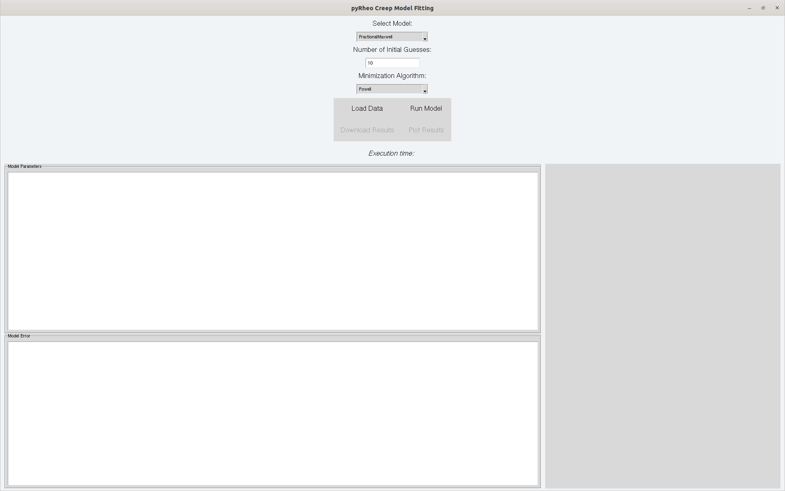
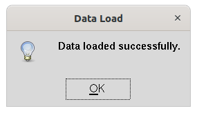
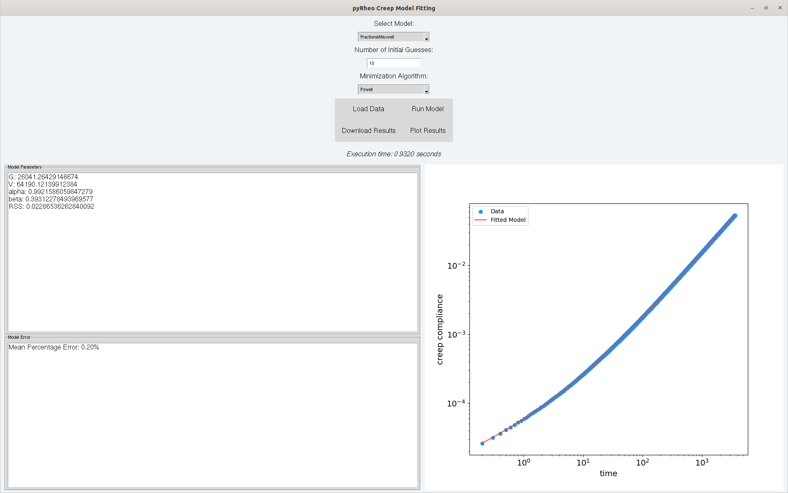

# Graphical User Interface (GUI) Tutorial

This tutorial provides step-by-step instructions on how to run a Python file using Anaconda on both Windows and Linux. The GUI for pyRheo is launched by executing either `pyRheo_creep_GUI.py`, `pyRheo_relaxation_GUI.py`, `pyRheo_oscillation_GUI.py`, or `pyRheo_rotation_GUI.py`.

## Prerequisites
Before getting started, ensure that you meet all the necessary requirements for using pyRheo. A recommended approach is to use Anaconda for managing dependencies and environments. Download Anaconda and follow the installation instructions suitable for your operating system.

## Step 1: Clone the GitHub Repository
Download the pyRheo package from [GitHub](https://github.com/mirandi1/pyRheo).

### Windows and Linux
1. Open a terminal (Windows: Anaconda Prompt or Command Prompt; Linux: Terminal).
2. Change the directory to where you want to clone the repository:
    ```shell
    cd /path/to/your/directory
    ```
3. Clone the GitHub repository using `git` (assuming Git is installed):
    ```shell
    git clone https://github.com/mirandi1/pyRheo
    ```
4. Navigate into the cloned repository and to the GUI folder:
    ```shell
    cd pyRheo/gui
    ```

## Step 2: Run the Python File
Execute the specific Python file. For example, in this tutorial we execute `pyRheo_creep_GUI.py`.

### Windows and Linux
1. Ensure you are in the correct directory:
    ```shell
    cd pyRheo/gui
    ```
2. Run the Python file:
    ```shell
    python pyRheo_creep_GUI.py
    ```
3. The GUI should prompt as a new window, see Figure 1.

Upon running the command, the GUI window titled "pyRheo Creep Model Fitting" will appear.



## Step 3: Using the GUI

### Loading Data
1. Click on the **"Load Data"** button to select the data file to use. The data file should be a CSV file with columns with header "Time" and "Creep Compliance", followed by their corresponding data. The user can look at the file `creep_ps190_data.csv` to understand the requirements in the file structure before loading. The delimiter between columns should be comma "," and decimal ".". Column headers in case of relaxation: "Time" and "Relaxation Modulus". Column headers in case of oscillation: "Angular Frequency" and "Storage Modulus", and "Loss Modulus". Column headers in case of rotation: "Shear Rate" and "Viscosity".
2. After successfully loading the data, a message box will notify you.



### Selecting the Model and Algorithm
1. Use the drop-down menu labeled **"Select Model:"** to choose the desired model.
2. Enter the number of initial guesses in the field labeled **"Number of Initial Guesses:"**. The default value is set to 10.
3. Use the drop-down menu labeled **"Minimization Algorithm:"** to select the optimization algorithm.

### Running the Model
1. Click the **"Run Model"** button to start the model fitting process.
2. The execution time will be displayed in the bottom part of the GUI.
3. After the model has run, the model parameters and fitting error will be displayed in the respective sections.

### Plotting Results
1. After running the model, click the **"Plot Results"** button to visualize the fitting results. The plot will display the original data points and the fitted model as in Figure 2.



### Downloading Results
1. Click the **"Download Results"** button to save the fitting results.
2. You will be prompted to choose a location and filename for the results. The results will be saved as a CSV file.
